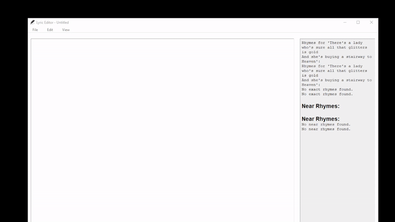
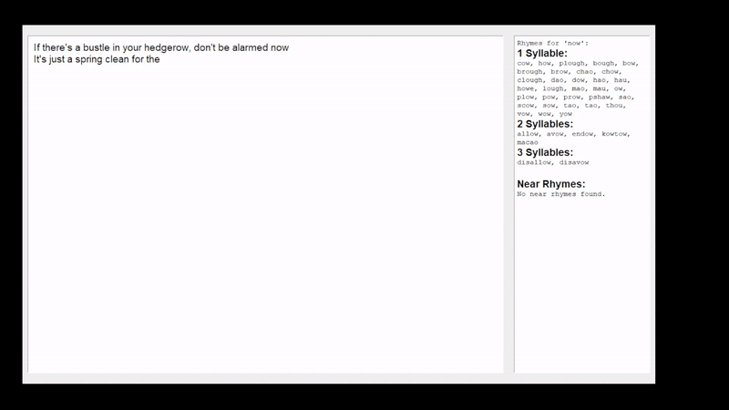
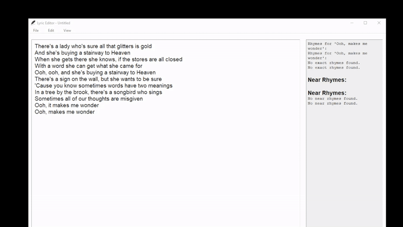
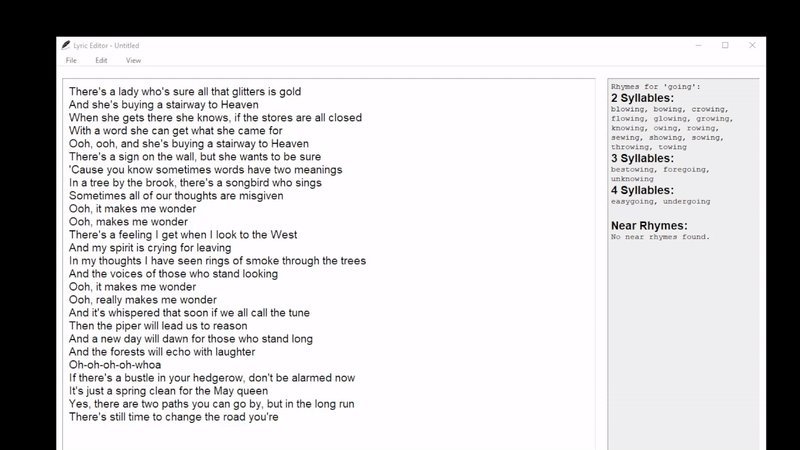

# 📝 Lyric-Editor

### Table of Contents

1. [About](#about)
2. [Technologies Used](#technologies-used)
3. [Prerequisites](#prerequisites)
4. [Demo](#demo)
5. [Contributing](#contributing)
6. [License](#license)

## About

This is a Python-based text editing application built using `tkinter` that offers rhymes for selected words. It's goal was is to cut out the middle man of going to rhymezone every 4 minutes. It supports basic text operations such as Cut, Copy, Paste, Undo, Redo, and file operations like New, Save, and Open. Additional features include:

- **Unlimited Undo and Redo**: Keep undoing and redoing your changes without limits.
- **Night Mode**: A dark mode to reduce eye strain in low-light environments.
- **Rhyme Suggestions**: For selected or recently typed words, the editor suggests rhymes, making it suitable for lyric or poetry writing.

This project was developed to explore Python GUI capabilities and enhance my skills in Data Structures and Algorithms (DSA).

## Technologies Used

- Python
- `tkinter` (Python GUI toolkit)
- `nltk` (for natural language processing tasks)
- `pronouncing` (for rhyme suggestions)

## Prerequisites

- Python 3
- Pip 3
- `tkinter` library
- `nltk` and `pronouncing` Python libraries

## Demo

- **Basic Text Editing**: Write, edit, and delete content in your file with ease.

  

- **Rhyme Suggestions**: Real-time suggestions for rhymes based on the word you type.

  

- **Dark Mode**: Switch to night mode to reduce glare and improve visibility in low-light conditions.

  

- **Unlimited Undo/Redo Operations**: Effortlessly revert or reapply your changes.

  

## Contributing

If you'd like to contribute, please see [CONTRIBUTING.md](https://github.com/p-cottrell/lyric_editor/blob/master/CONTRIBUTING.md) for more details. Feel free to reach out via [email](mailto:p.cottrell@egmail.com) if you have any questions or suggestions.

## License

Text Editor is licensed under the MIT license. Please see [LICENSE.md](https://github.com/p-cottrell/lyric_editor/blob/master/LICENSE.md) for more details.

